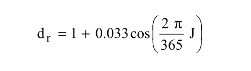
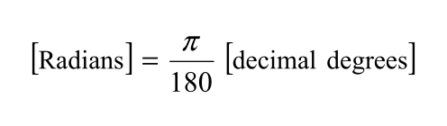
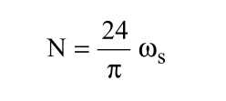
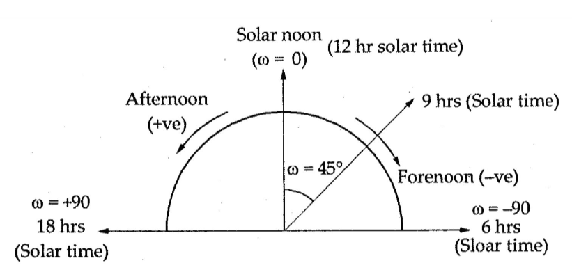
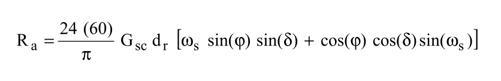
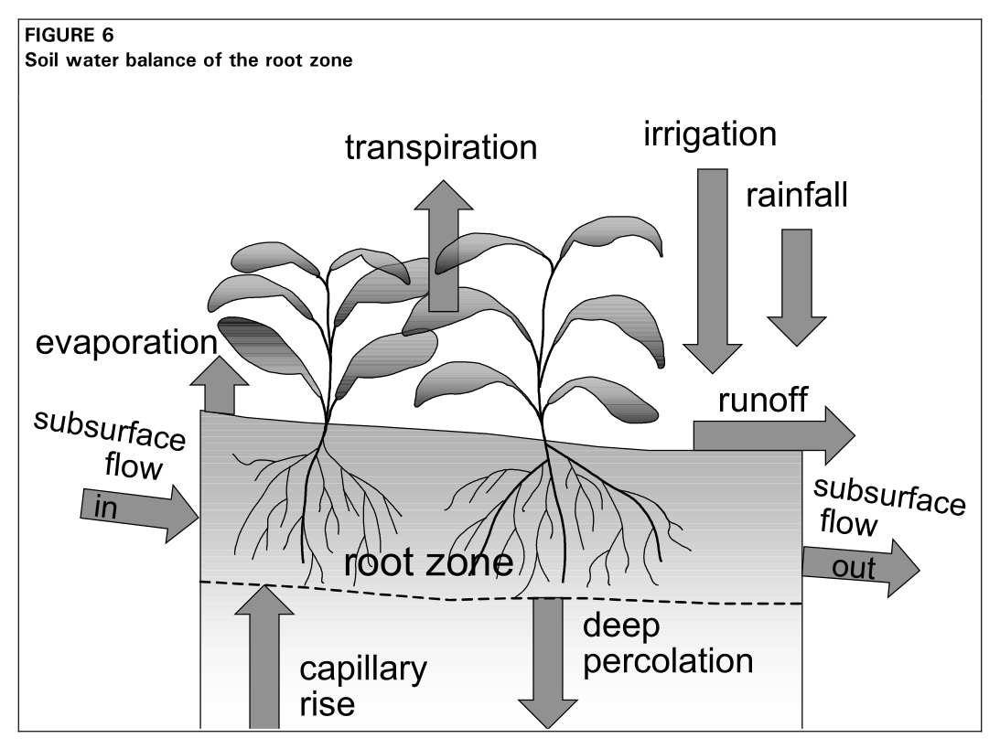
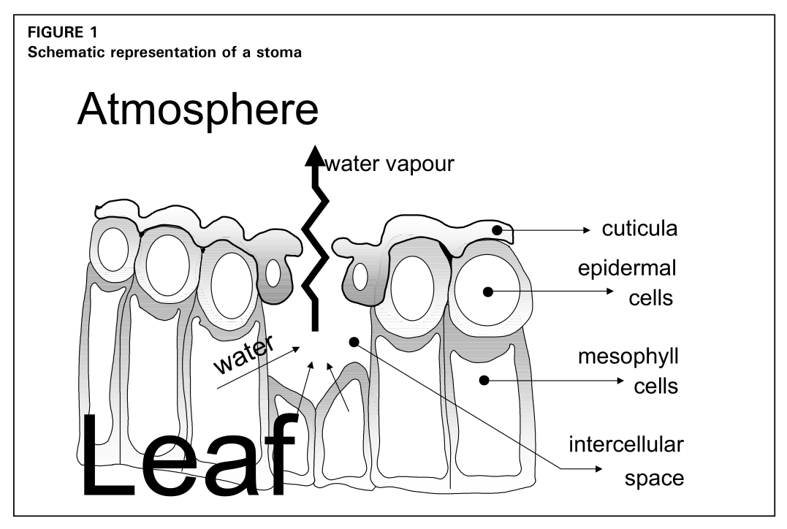

## Введение к *Leaves on Leaves*

Основной фокус при подготовке этих заметок достаточно широк и вместе с тем конкретен, так что можно сразу же обозначить некоторые ограничения и не подразумевать их само собой возникающими из слов «фитоматематика», «экология», «топология», «форма» и других.

Индивидуальный познавательный интерес, руководящий подготовкой и написанием этих разрозненных любительских заметок, можно охарактеризовать так:

> *развивать вариационный взгляд на пространственную организацию растений (в частности, листа) во взаимодействии с процессами различного генеза (например, микрометеорологическими, физиологическими, экосистемными); иначе говоря, взгляд на лист как на динамический интерфейс, или композицию организованных процессов различного генеза и ограничений.*

Интерес в том, чтобы развивать такой взгляд и по возможности документировать его развитие, делать его доступным и открытым для других и для последующих изменений.

Что касается выражения **«вариационный взгляд»**, стоит сказать, что речь не идет о вариационном исчислении и его методах, а подразумевается нечто вроде «вариационного мышления» — и вот как можно предварительно это понять. Применительно к *живому* растению, способному экспериментировать среди возможных решений (особенно в контексте экосистемных процессов), не кажется обоснованным ставить вопрос о минимизации некоторого функционала: пространственная организация растения и листа даже с чисто функциональной точки зрения решает не всегда и не только задачи оптимизации, но и, к примеру, задачи совозможности (*compossibility*), устойчивости (*retention*), непрерывности роста (*continuous morphogenesis*) и другие. То есть, во-первых, различные решения организуют пространство так, что взаимодействие «тех же самых» процессов может выражаться разными *видами отношений*. Во-вторых, если смотреть на пространство объектно, то есть в данном случае как на организацию процессов различного генеза, можно обоснованно ставить вопрос о том, *почему* реализован наблюдаемый объект и *как* организовано наблюдаемое пространство среди возможных — как устроен набор вариаций.

Поскольку нет никаких оснований считать, будто «природа *всюду* оптимизирует» и «эволюция обязалась предлагать *только* лучшее», более адеватной в данном случае представляется мысль не об оптимуме, а о **допустимой области решений** (*feasible*). Короче говоря, не лишено смысла исходить из предположения, что живая природа из множественной вариации избирает *как минимум* вариант *жизнеспособный* и что в допустимой области существуют и другие возможности. Кроме того, представляется само собой разумеющимся, что **выход из строя** (*failure modes*) и **последовательность распада** (*corruption sequences*) организованного пространства следует рассматривать в том же ряду вариаций.

Описанный интерес может пересекаться, но *не совпадать* с подходами, принятыми в **морфометрии** (*morphometrics*), моделировании **теоретических морфопространств** (*theoretical morphospaces*), — традицией, идущей от ДʼАрси Томпсона [[1]](https://commons.wikimedia.org/wiki/File:On_growth_and_form_(IA_ongrowthform1917thom).pdf) [[2]](https://commons.wikimedia.org/wiki/File:On_growth_and_form_(1945_ed).djvu) и продолжающейся в работах Дэвида Раупа [[3]](https://www.jstor.org/stable/1301992), Джорджа МакГи [[4]](https://cup.columbia.edu/book/theoretical-morphology/9780231106160) [[5]](https://doi.org/10.1017/CBO9780511618369) и других.

Описанный интерес также может *частично* пересекаться с идеями, предложенными в исследованиях **вычислений посредством распространения** (*computing by propagation*), **программирования в ограничениях** (*constraint-based programming*), **вычислений с неполной информацией** (*partial information*) — в работах Джеральда Сассмана и Алексея Радула [[6]](https://dspace.mit.edu/entities/publication/295b4ade-7ab5-4787-b5d1-417905fe7ab0) [[7]](https://dspace.mit.edu/entities/publication/e34605be-2467-473f-9166-e644c5a0082c) и других (см. также: *SICP 3.3.5* [[8]](https://web.mit.edu/6.001/6.037/sicp.pdf)).

* * *

## Введение к *Leaf01*

Первоначально текст этой заметки был записью в [журнал разработки](https://github.com/cloclacordis/FieldEdge-Evapotranspiration/tree/main/Docs/Devjournal/Devlogs), сделанной в ходе проектирования [вычислительного ядра](https://github.com/cloclacordis/FieldEdge-Evapotranspiration/tree/main/Code) для автономных полевых систем ирригации. Нелишним будет разместить эту запись и здесь, в контексте заметок по фитоматематике и экологии растений.

Эта запись посвящена объяснению **физического смысла и геометрических аспектов** как самого процесса **внеземного излучения** (*extraterrestrial radiation, Ra*), так и процесса его вычисления в уравнении эталонной эвапотранспирации [Пенмана–Монтейта](https://en.wikipedia.org/wiki/Penman%E2%80%93Monteith_equation) (*Penman–Monteith equation, reference evapotranspiration, RET, ETo*). Эту заметку можно использовать для лучшего понимания технической документации [*FAO56*](https://www.fao.org/4/x0490e/x0490e00.htm), 

Первоначально, в процессе разработки программного обеспечения и в ходе документации этого процесса, внимание на внеземном излучении было сосредоточено потому, что из-за тригонометрических и астрономических аспектов этот член уравнения представлялся одним из наиболее трудных для понимания физического смысла вычислений. Представлялось, что это ведет к затруднению ясного и связного взгляда на процесс эвапотранспирации в целом и на программное проектирование вычислений.

К документации процесса разработки также была добавлена необязательная часть в виде постскриптума, где предлагался взгляд на общий контекст, или «картину» (*Naturschauspiel*) процессов транспирации растений, фотосинтеза и внеземного излучения. Можно было бы назвать это своего рода «контекстной диаграммой» — не обязательной с точки зрения изготовления артефактов, в частности, программного обеспечения, но, как казалось, необходимой для познавательного интереса. Учитывая центральную роль этого интереса в текущих заметках (*Leaves on Leaves*), первоначальная запись, как уже сказано, приводится здесь повторно и без существенных изменений.

> Ссылки на уравнения и диаграммы даются по изданию *FAO56* 1998 года. В 2025 году появилось первое [пересмотренное издание](https://agrhysmo.agr.unipi.it/wp-content/uploads/2025/09/FAO56%202025.pdf) документации. В отношении обсуждаемых здесь тем принципиальных расхождений в вычислениях между двумя этими изданиями нет.

* * *

# Физический смысл и геометрические аспекты внеземного излучения

## Источник энергии

В основе вычислений эталонной эвапотранспирации лежит простой факт: Земля непрерывно получает **поток энергии** от Солнца. Такие процессы, как нагрев воздуха и почвы, испарение воды, биофизическая активность растений, движение атмосферы, являются в том или ином виде следствиями перераспределения этой энергии. С точки зрения системного взгляда на экологические процессы на Земле внеземное излучение рассматривается как **энергетический вход системы**, что может быть описано количественно. В свою очередь количественные характеристики энергетического входа системы напрямую связаны с **геометрией движения** небесных тел.

В ядре Солнца (ближайшей звезды) протекает термоядерный синтез: сотни миллионов тонн водорода превращаются в гелий, а часть массы вещества, несколько миллионов тонн, переходит в энергию по соотношению Эйнштейна *E = mc2*. Постепенно, за сотни тысяч лет, эта энергия перемещается от ядра к поверхности Солнца и выходит за его пределы в виде электромагнитного излучения — фотонов разных длин волн: от ультрафиолета до инфракрасного диапазона в интересующем нас случае.

Солнце излучает энергию почти равномерно во всех направлениях. На расстоянии орбиты Земли поток энергии распределен по сфере радиусом около 150 миллионов километров. Если измерить, сколько энергии в единицу времени приходится на единицу площади, расположенной **на верхней границе атмосферы** перпендикулярно солнечным лучам, получим число, называемое **солнечной постоянной** (*solar constant, Gsc*): *0.0820 МДж на квадратный метр в минуту*, или около *1361 Вт/м2* по современным подсчетам. Иными словами, на каждый квадратный метр поверхности верхней границы земной атмосферы, расположенной перпендикулярно солнечным лучам, приходится некоторая (небольшая) часть общего потока солнечной энергии.

Солнечная постоянная — исходная точка всех расчетов потока радиации в *FAO56*. Остальное в уравнении *Ra* — геометрия, точнее, **тригонометрия и сферическая астрономия**: уточнение того, *как именно* поток энергии направлен к горизонтальной поверхности в той или иной точке Земли в конкретный день или час.

Дальнейшие параграфы подробнее раскроют смысл этих уточнений.

После прохождения верхней границы атмосферы в дело вступают облака, водяной пар, аэрозоли, рассеяние, альбедо, поток тепла в почву и прочее, что позволяет выделять различные компоненты из входного потока радиации и в конечном счете получать значение **чистой радиации** (*net radiation at the crop surface, Rn*) — и использовать его в расчете эталонной эвапотранспирации.

Приведем иллюстрацию, позволяющую наглядно представить входной поток радиации с дальнейшим разбиением его на компоненты системы (*FAO 1998: 44, fig. 15*):

С точки зрения математической модели физического процесса и с точки зрения программы для вычисления эталонной эвапотранспирации [**модуль внеземного излучения**](https://github.com/cloclacordis/FieldEdge-Evapotranspiration/blob/main/Code/04-calculation/045-radiation-calc/extrater-radiation-calc.c) отвечает на **единственный вопрос** (впрочем, предполагающий ряд деривативов для его постановки):

*какое количество солнечной энергии в принципе может быть доступно для данной географической широты в данный день или час года, если принять во внимание только положение Земли относительно Солнца?*

* * *

## Уточнение первое. Орбита и удаленность Земли от Солнца

Земля вращается вокруг Солнца не по окружности, а по эллипсу. Разница не столь велика, но она есть: эксцентриситет орбиты составляет около *0.017*. В начале января Земля находится ближе к Солнцу примерно на *3.3%* (перигелий), чем в начале июля (афелий). Поскольку интенсивность излучения убывает с квадратом расстояния, поток энергии, достигающий верхней атмосферы Земли, меняется в течение года примерно на *6‒7%*.

В документации (*FAO 1998: 46, eq. 23*) эта поправка введена как **обратное относительное расстояние Земля–Солнце** (*inverse relative distance Earth–Sun, dr*):

Здесь *J* — номер дня года от 1 до 365 или 366 для високосного года. Когда значение *J* близко к *1*, косинус близок к *1* и *dr > 1*: Земля находится ближе к Солнцу (январь, перигелий), поток энергии сильнее. Когда *J ≈ 182*, косинус отрицательный и *dr < 1*: Земля расположена дальше от Солнца (июль, афелий), поток энергии слабее. Амплитуда поправки составляет *0.033* — упомянутые ранее *±3.3%* от единицы — и вводится в уравнение в качестве константы.

Переменная *dr* входит в уравнение *Ra* (приводится ниже) как прямой множитель: с увеличением расстояния от Земли до Солнца значение *dr* снижается, пропорционально снижая величину поступающей энергии. Эта циклическая неравномерность подчиняется **законам движения Кеплера**, однако в прикладных расчетах она *аппроксимируется* простой тригонометрической функцией, аргумент которой делит год на *равные* части.

* * *

## Уточнение второе. Наклон земной оси и склонение Солнца

Более существенно влияет на сезонность не эллиптичность земной орбиты, а **наклон земной оси**, или **оси вращения Земли** (*axial tilt, obliquity*). По отношению к плоскости орбиты земная ось наклонена под углом примерно *23.45°* (Северный полюс в текущую эпоху направлен на Полярную звезду). Этот наклон имеет следствием смену времен года.

Можно представить вид на Солнечную систему «сбоку»: в июне Северный полюс обращен к Солнцу — лучи падают на северное полушарие более отвесно, продолжительность светового дня здесь максимальна (летнее солнцестояние). В декабре ситуация обратная (зимнее солнцестояние) — к Солнцу обращено южное полушарие.

На экваторе смена сезонов выражена слабее всего, поскольку солнце над экватором поднимается высоко круглый год, и полуденные лучи всегда падают *почти* вертикально. В дни равноденствий в марте и сентябре в астрономический полдень лучи падают к экватору под углом *90°*, а в периоды максимального склонения в июне и декабре — под углом *90° ‒ 23.45°  = 66.55°*. Для сравнения: в умеренных широтах полуденное Солнце летом может подниматься над горизонтом на *60°*, тогда как зимой угол падает до *10‒15°*, определяя существенную разницу в притоке энергии.

В документации (*FAO 1998: 46, eq. 24*) эта поправка введена как **солнечное склонение** (*solar declination, δ*):

Солнечное склонение — это угол между экватором Земли и прямой, соединяющей центры Земли и Солнца, или угловое положение Солнца относительно земного экватора. Иными словами, *δ* показывает, над какой географической широтой Земли Солнце находится в зените в астрономический полдень данного дня года *J*. Солнечное склонение измеряется в радианах. В отличие от постоянного значения наклона земной оси, склонение Солнца — переменная величина.

В день летнего солнцестояния *J ≈ 172, δ ≈ +0.409 рад ≈ +23.45°*: Солнце в зените над тропиком Рака. В день зимнего солнцестояния *J ≈ 355, δ ≈ ‒0.409 рад ≈ ‒23.45°*: Солнце в зените над тропиком Козерога. В дни равноденствий *J ≈ 80, J ≈ 264, δ ≈ 0°*: Солнце в зените над экватором.

Вводимая в уравнение константа *0.409* — наклон земной оси *23.45°*, записанный в радианах. Сдвиг фазы *‒1.39 рад*, введенный в уравнение, смещает максимум солнечного склонения на конец июня, поскольку уравнение предполагает стандартный порядковый счет дней от календарного начала года — *J = 1 = 1 января*, — а не от точки весеннего равноденствия.

* * *

## Уточнение третье. Географическая широта

**Географическая широта** (*latitude, φ*) определяет угол, под которым солнечные лучи падают на горизонтальную поверхность в некоторый день *J* в данной точке Земли. В уравнении внеземной радиации широта приводится к значению в радианах.

На широте земного экватора солнечные лучи, как сказано, падают почти отвесно, *φ = 0°*. Чем дальше от экватора и чем ближе к полюсам, тем более косо падают на Землю солнечные лучи, тем больше площадь их распределения и тем меньше энергии приходится на каждый участок поверхности. Высокие широты получают меньше энергии на квадратный метр в минуту. На Северном полюсе *φ = +90° = +π/2 рад*, на Южном полюсе *φ = ‒90° = ‒π/2 рад*.

В [тестовых наборах](https://github.com/cloclacordis/FieldEdge-Evapotranspiration/tree/main/Code/06-test) вслед за документацией *FAO56* использованы эталонные значения для расчета внеземной радиации на широтах Бангкока, *φ ≈ +13.73°*, и Рио-де-Жанейро, *φ ≈ ‒22.90°*.

В уравнении *Ra*  эти отношения появляются в виде суммы тригонометрических произведений *sin(φ) × sin(δ) + cos(φ) × cos(δ)* — геометрической записи проекции солнечного луча на горизонтальную поверхность, или угла между солнечным лучом и нормалью к горизонтальной поверхности в данной широте. (Произведение здесь приводится в усеченной форме и описывает полуденную геометрию — полное выражение должно учитывать угол захода Солнца, о чем будет сказано ниже.)

Здесь стоит повторить, что речь идет о гипотетическом участке на верхней границе атмосферы, об энергетическом входе системы, а не о геодезической, эмпирической поверхности Земли.

Чтобы получить значение *φ* в радианах для использования его в вычислениях, зная только географическую широту, можно воспользоваться следующей формулой (*FAO 1998: 46, eq. 22*):

Стоит пояснить это на примерах (*FAO 1998: 46, ex. 7*).

Бангкок имеет географические координаты *13°44'N*, то есть 13 градусов и 44 минуты северной широты. Сперва можно перевести эти координаты в **десятичную форму записи градусов** (*decimal degrees*): *13 + 44/60 = +13.73°*. Теперь умножим *π/180* на полученное десятичное значение: *(π/180) × 13.73 ≈ +0.240*. Значение *φ* **в радианах** для Бангкока *≈ +0.240 рад*.

Для Южного полушария, например, для широты Рио-де-Жанейро *22°54'S*, значения координат в градусах и минутах берутся с отрицательным знаком: *(‒22) + (‒54/60)*, или *‒(22 + 54/60) = ‒22.90°* в десятичной записи. И далее: *(π/180) × (‒22.90) ≈ ‒0.400 рад*.

Обратный перевод из значения радиан в значение десятичных градусов возможен через замену: *180/π*.

* * *

## Уточнение четвертое. Продолжительность солнечного сияния

Поскольку Земля вращается вокруг своей оси, с точки зрения наблюдателя на поверхности Земли Солнце движется по небосводу. Утром Солнце восходит на востоке, в астрономический полдень достигает максимальной высоты, вечером заходит на западе. Ключевую роль в вычислении суточного потока энергии играет то, сколько именно времени Солнце находится над горизонтом в данной точке в данный день года.

Угол, на который Земля поворачивается вокруг своей оси за промежуток времени от момента истинного полудня до момента заката, называется **часовым углом заката** (*sunset hour angle, ωs*), измеряется в радианах и рассчитывается по следующей [формуле](https://en.wikipedia.org/wiki/Sunrise_equation) (*FAO 1998: 46, eq. 25*):

В физическом смысле *ωs* — это **угловая мера половины светового дня**. В момент истинного полудня Солнце проходит местный меридиан и часовой угол равен нулю. Земля продолжает вращение, Солнце смещается к западу, и к моменту заката оказывается, что Земля по отношению к истинному полудню совершила поворот на угол *ωs*.

Полный оборот в *360° (2π радиан)* Земля совершает за *24 часа*, что соответствует скорости вращения *15° за 1 час* солнечного времени. Если бы день всегда длился ровно *12 часов*, то от полудня до заката проходило бы *6 часов*, и за это время Земля поворачивалась бы ровно на четверть полного оборота: *90° = π/2 рад*. Однако из-за наклона земной оси и зависимости траектории движения Солнца по небосводу от географической широты значение *ωs* непрерывно меняется в течение года.

Формула нахождения *ωs* выводится из сферической тригонометрии. Солнце находится на горизонте, когда его высота над горизонтом равна нулю. Условие нулевой высоты Солнца над горизонтом записывается через широту *φ* и склонение *δ*, что после алгебраических преобразований дает указанное выражение через арккосинус.

> Подробнее см., например, разделы «2.2. Экваториальная система координат», «2.7. Восход и заход небесных тел» в книге: *Жаров В. [Сферическая астрономия](https://iaaras.ru/media/library/zharov_sf.pdf), 2006*.

Используя расчетный часовой угол *ωs*, можно определить **максимально возможную продолжительность солнечного сияния**, или **длину светового дня в часах** (*maximum possible duration of sunshine or daylight hours, N*) по формуле (*FAO 1998: 48, eq. 34*):

Это уравнение представляет собой прямой перевод угловой меры вращения Земли во временн*у*ю, из радиан — в часы. Поскольку полный оборот Земли *2π рад = 24 ч*, угол *ωs* линейно преобразуется в часы от полудня до заката, а полный световой день равняется удвоенному значению этого промежутка (*2ωs*).

Часовой угол служит мерой солнечного времени: например, углу *ω = 45°* соответствует разница в *3 часа* между истинным полуднем (*12 hr solar time*) и утренним положением Солнца (*9 hr solar time*).

В Бангкоке (*φ ≈ +13.7°*) и Рио (*φ ≈ ‒22.9°*) значения продолжительности дня *3 сентября* близки, поскольку дата приближается к осеннему равноденствию: в обоих полушариях солнечная дуга над горизонтом близка к симметричной относительно экватора, а продолжительность дня близка к *12 часам*.

*23 сентября*, при полной симметрии солнечной дуги относительно экватора в обоих полушариях, склонение *δ ≈ 0°*, аргумент арккосинуса обнуляется, а *ωs* становится равен *π/2*, что дает длину дня в *12 часов* для любой точки планеты.

Если комбинация широты и сезона такова, что аргумент *arccos* выходит за пределы допустимого интервала *[−1, +1]*, это указывает на экстремальные полярные явления и означает, что Солнце либо вообще не заходит (полярный день, *ωs = π, N = 24 ч*), либо вообще не восходит (полярная ночь, *ωs = 0, N = 0 ч*). В последнем случае суточный приток внеземной радиации равен нулю (*Ra = 0 МДж · м−2 · день−1*).

* * *

## Линковка уравнения внеземной радиации

Теперь можно целиком собрать уравнение внеземного излучения *Ra* **для периода продолжительностью в световой день** (*FAO 1998: 46, eq. 21*) и раскрыть его физический смысл:

> Для вычисления почасовых и более коротких периодов *Ra* уравнение в целом аналогично, в него только добавляется разность значений часовых углов (*solar time angles*) в начале (*ω1*) и в конце (*ω2*) рассматриваемого периода вместо единого *ωs*. Способ вычисления описан в документации (*FAO 1998: 47, eq. 28; 48, eq. 29, 30*).

Элемент *24 × 60 / π = 1440 / π* переводит минутную интенсивность излучения в суточный интеграл — в «энергию за сутки», то есть за *1440 минут*.

Произведение *Gsc × dr* выражает интенсивность солнечного потока на верхней границе атмосферы в конкретный день *J* с учетом поправки на эксцентриситет орбиты.

Выражение *ωs × sin(φ) × sin(δ) + cos(φ) × cos(δ) × sin(ωs)* означает интеграл от косинуса угла падения лучей за световой день. Это показывает, что суточная траектория движения Солнца по небосводу (геометрия падения лучей во времени) берется как интеграл по часовому углу солнечного времени от *‒ωs* (восход) до *+ωs* (закат). При интегрировании по времени возникают два члена: один связан с произведением вертикальных компонент (*sin φ × sin δ*), другой — с произведением горизонтальных компонент (*cos φ × cos δ × sin ωs*). Первый описывает влияние склонения Солнца (*как высоко* оно расположено в полдень), второй — влияние продолжительности светового дня (*насколько долго* длится инсоляция).

* * *

# Постскриптум. Фотосинтез, транспирация, излучение

Эвапотранспирация начинается с потока солнечной энергии, достигающего верхней границы атмосферы Земли. Впоследствии эта энергия проходит через систему «почва — растение — атмосфера», распределяясь между несколькими взаимосвязанными потоками вещества и энергии. Этот непрерывный обмен определяет водный баланс территории и доступность влаги для растений (*FAO 1998: 12, fig. 6*).

Вычисление эвапотранспирации в конечном счете носит прикладной характер и связано с решением практических задач ирригации. Сельскохозяйственная культура постоянно теряет влагу двумя путями: через **испарение** с поверхности почвы (*evaporation*) и через **транспирацию** растений (*transpiration*). Суммарный процесс этих потерь называется **эвапотранспирацией** (*evapotranspiration*).

Испарение представляет собой переход воды из жидкого состояния в газообразное с последующим удалением водяного пара в атмосферу. Этот процесс происходит на любых влажных поверхностях: почве, листьях, водоемах, строительных материалах и других.

Для превращения жидкой воды в водяной пар необходим приток энергии, достаточный для разрыва водородных связей между молекулами. Основным источником этой энергии является солнечная радиация. Дополнительную, но менее существенную роль играет температура окружающего воздуха. Однако для испарения одного только подвода энергии недостаточно — чтобы испарение продолжалось, образующийся водяной пар должен удаляться с поверхности. Если воздух рядом с поверхностью становится слишком влажным, испарение замедляется. Важную роль играет **движение воздуха**: ветер удаляет насыщенный водяным паром воздух и заменяет его более сухим, поддерживая **градиент парциального давления водяного пара** между поверхностью и атмосферой.

Транспирация представляет собой процесс потери влаги, протекающий внутри растительной системы. В некотором смысле решение практических задач ирригации связано с тем, что почти вся вода, поглощаемая растением, в конечном счете возвращается в атмосферу в виде водяного пара и лишь незначительная ее часть используется в биохимических процессах. **Растение постоянно нуждается в воде, которую оно почти не использует, но непрерывно теряет.**

Здесь хочется выяснить, почему так происходит, показать место этого процесса в общем потоке энергии, а также сделать несколько необязательных предположений.

* * *

В процессе **фотосинтеза** — получения углерода из атмосферного *CO2* — растение сталкивается с принципиальной проблемой. Чтобы получить *CO2*, нужно открыть **устьица** (*stomata*) — микроскопические поры в листьях, через которые углекислый газ поступает внутрь листа. Однако атмосфера почти всегда суше внутреннего пространства листа, поэтому при открытии устьиц возникает сильный градиент, наружу начинает диффундировать водяной пар, и поглощенная корнями влага переходит от растения в атмосферу (*FAO 1998: 2, fig. 1*). Транспирация является ценой фотосинтетического газообмена.

Стоит рассмотреть подробнее устройство этого процесса.

Корни поглощают влагу из почвы главным образом за счет **разности водного потенциала**. Почва обычно содержит воду сравнительно более доступную, чем ткани растения, так что вода движется внутрь корня **осмотически**. Затем она попадает в **ксилему** — систему проводящих сосудов растения, нечто вроде непрерывной гидравлической сети, идущей от корней к листьям.

Подъем жидкости вверх требует преодоления гравитации. Животные для этого используют сердце, создающее давление. У растений такого органа нет, и подъем воды создается сверху: когда в листьях вода испаряется в межклеточное пространство и затем выходит через устьица в атмосферу, в водной колонне ксилемы возникает **натяжение** (*tension*). Поскольку молекулы воды сцеплены между собой **водородными связями** (*cohesion*), испарение влаги с листа тянет вверх весь водяной столб. Этот молекулярный конвейер работает по принципу **капиллярно-испарительной системы** (*cohesion–tension mechanism*). Основная энергия, поддерживающая этот процесс в масштабе всей системы, поступает от потока солнечного излучения.

Как сказано выше, вода используется растением лишь в незначительной степени: она участвует в фотосинтезе, входит в состав клеток и поддерживает тургор тканей, используется в биохимических реакциях и транспорте минеральных веществ. Основная масса воды проходит через растение транзитом. Если смотреть на растение как на биохимический автомат, такая организация процесса представляется досадной недоработкой. Однако растение представляет собой еще и **тепловую систему**. Чтобы перевести жидкую воду в пар, нужно затратить **скрытую теплоту парообразования** (*latent heat of vaporization*). Эта энергия забирается у листа. Без транспирации листья под потоком солнечного излучения быстро перегревались бы до температур, повреждающих аппарат фотосинтеза. Таким образом, транспирация выполняет функцию охлаждения и поддержания потока тепла. Растение постоянно балансирует между потерей воды и получением углерода, охлаждением и риском перегрева и обезвоживания.

Транспирация является частью глобального круговорота вещества и энергии, а **растение играет роль важнейшего «интерфейса» в организации различных потоков**, перенося воду из почвы в атмосферу, охлаждая поверхность суши, влияя на влажность воздуха, участвуя в формировании облаков и осадков, преобразуя солнечную энергию в химическую.

* * *

Если смотреть на растение как на автомат преобразования солнечной энергии и углекислого газа в биомассу, обычные сельскохозяйственные культуры кажутся слишком расточительными с точки зрения расхода воды. Для фиксации одного моля *CO2* вследствие физики газообмена растение теряет через устьица сотни молей воды.

В первую очередь сами растения пробовали решать проблему «развязки» воды и *CO2* посредством разных стратегий. К примеру, кукуруза, сахарный тростник, сорго используют механизм, называемый ***C4*-фотосинтезом** (*C4 carbon fixation*). С точки зрения транспирации его идея состоит в том, чтобы сперва концентрировать *CO2* во внутренних тканях, а после использовать его в цикле Кальвина в процессе фотосинтеза, что позволяет не держать устьица все время открытыми и, следовательно, ведет к меньшей потере воды (такой механизм, среди прочего, позволяет лучше адаптироваться к жаре и сильному излучению). Другую стратегию — ***CAM*-фотосинтез** (*crassulacean acid metabolism, CAM photosynthesis*) — используют кактусы, агава, суккуленты, ананас и ваниль. Здесь идея заключается в том, чтобы открывать устьица ночью, когда температура воздуха прохладнее, влажность выше, испарение слабее. Ночью растение запасает *CO2* в виде органических кислот, а днем держит устьица почти закрытыми, используя для фотосинтеза запасенный *CO2*. Правда, цена такой стратегии — серьезные энергетические ограничения — медленный рост, невысокая скорость фотосинтеза, низкая продуктивность.

* * *

Возможно ли решение проблемы потери влаги в процессе транспирации, или человеческая инженерия в некотором смысле обречена на то, чтобы обслуживать расточительность растения, переводя проблему в решение прикладных задач ирригации — в решение проблемы среды и внешних условий?

Представляется, что стоит решить хотя бы одну из описанных проблем удержания влаги растением. К примеру, пойти путем разработки более эффективных аналогов *C4*-фотосинтеза или *CAM*: научиться быстро захватывать *CO2*, удерживать его внутри растения, регулировать открытие устьиц, сводя его к минимуму. На ум приходят попытки встроить *C4*-механизмы в рис, инженерия «умных» устьиц, усиление механизмов концентрации *CO2*. Или, например, подумать о том, как можно было бы отводить энергию, избегая процесс транспирации, скажем, через разработку другой архитектуры или микроструктуры листа, пригодной для конвективного охлаждения. Возможно, стоит думать о создании масштабируемых искусственных фотосинтетических систем, работающих в закрытых циклах.

Так или иначе, главной «проблемой» является то, что является и главной особенностью растения как активного компонента биосферы: **растение встроено в планетарную физику** и не является обособленным автоматом. Транспирация — не дефект устройства растения, а следствие того, каким образом наземная фотосинтезирующая жизнь встроена в обмен веществом и энергией между сушей и атмосферой. Через испарение растения рассеивают значительную долю энергии излучения, приходящейся на поверхность суши. Можно представить биосферу без транспирации: поверхность суши нагревается, изменяются облачные процессы, осадки, атмосферная циркуляция, климат.

Кажется, вопросы эффективности ирригации и управления водными ресурсами в сельском хозяйстве имеют свои пределы — главным образом в постановке проблемы исходя из среды и внешних условий. Вполне может быть, что дальние решения будут связаны с тем, чтобы разъединить потоки внутри самих физических механизмов жизни и иначе реорганизовать процессы в пространстве растения.

* * *
